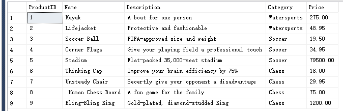
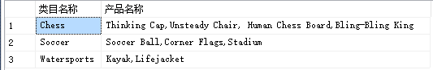

## sql合并多行数据
- [for xml path的用法](#xml)
- [stuff函数的用法](#stuff)

### <a name="xml"></a> for xml path
例：表中原始数据如下
    
利用 ```for xml path```函数可以输出XML格式的查询结果，代码如下：
```sql
SELECT TOP 3 *
FROM dbo.Products
FOR XML PATH('ProductInfo')
```
语句执行结果如下：
```xml
<ProductInfo>
  <ProductID>1</ProductID>
  <Name>Kayak</Name>
  <Description>A boat for one person</Description>
  <Category>Watersports</Category>
  <Price>275.00</Price>
</ProductInfo>
<ProductInfo>
  <ProductID>2</ProductID>
  <Name>Lifejacket</Name>
  <Description>Protective and fashionable</Description>
  <Category>Watersports</Category>
  <Price>48.95</Price>
</ProductInfo>
<ProductInfo>
  <ProductID>3</ProductID>
  <Name>Soccer Ball</Name>
  <Description>FIFA-approved size and weight</Description>
  <Category>Soccer</Category>
  <Price>19.50</Price>
</ProductInfo>
```
语句解释：
1. 通过sql中的关键字as可以给每列重命名，由此可以修改xml节点
2. path可以带参数也可以不带，默认行节点为row

### <a name=stuff></a>stuff函数
STUFF 函数将字符串插入另一字符串。它在第一个字符串中从开始位置删除指定长度的字符；然后将第二个字符串插入第一个字符串的开始位置。
STUFF ( character_expression , start , length ,character_expression_insert )
参数说明:
- character_expression: 原始字符串
- start: 开始位置
- length: 删除的长度
- character_expression_insert: 要插入的字符串

需求：选取同一类目下的所有产品名称
具体代码如下：
```sql
SELECT  Category AS '类目名称',
        STUFF(( SELECT  ',' + Name
                FROM    dbo.Products
                WHERE   Category = p.Category
              FOR
                XML PATH('')
              ), 1, 1, '') AS '产品名称'
FROM    dbo.Products AS p
GROUP BY p.Category;
```
执行结果如下：
  
语句解释：
1. 通过加入分隔符拼接字符串可以使xml格式的结果变成字符串
2. 通过STUFF函数可以去除结果中的第一个字符(,)
3. 通过分组得到最终结果